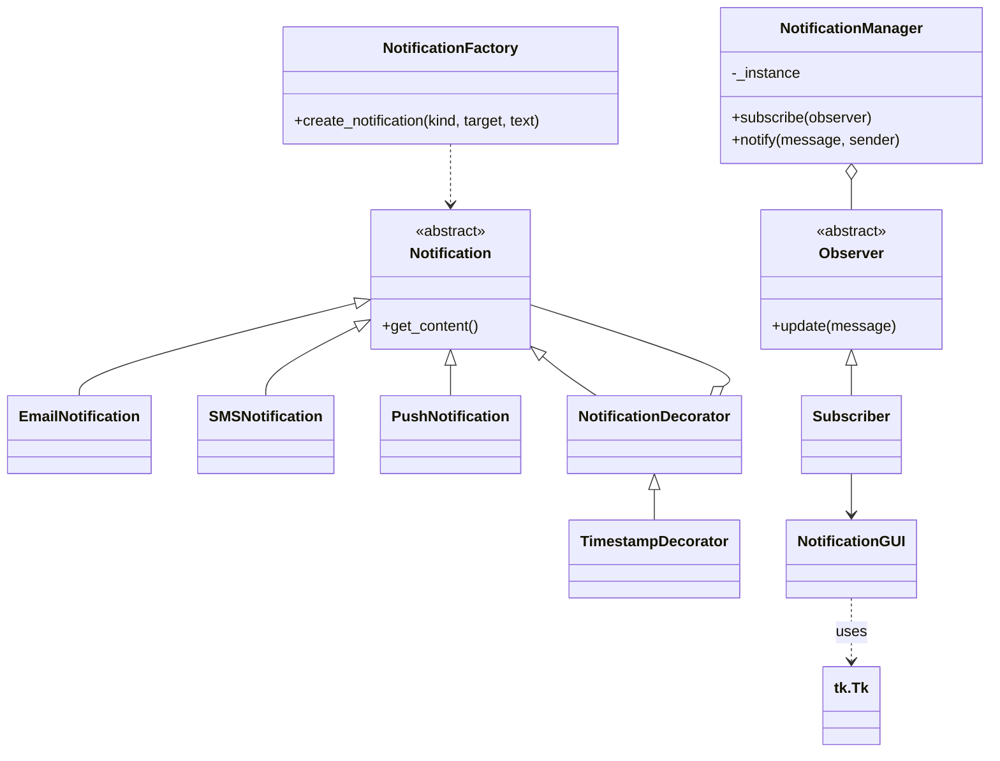

# act_integradora_3-8

## Patrones de Diseño Utilizados

### 1. Observer

**Descripción del problema:**  
Se necesitaba que múltiples usuarios recibieran notificaciones en tiempo real cuando un usuario enviaba un mensaje, sin acoplar directamente los emisores y receptores.

**Razón de elección:**  
El patrón Observer permite que los objetos suscriptores reciban actualizaciones automáticamente cuando ocurre un evento, desacoplando el emisor de los receptores.

**Solución implementada:**  
Se creó una clase `NotificationManager` como sujeto, y los usuarios (`Subscriber`) se suscriben a este. Cuando un usuario envía un mensaje, el `NotificationManager` notifica a todos los suscriptores excepto al emisor.

---

### 2. Singleton

**Descripción del problema:**  
Era necesario que existiera un único gestor de notificaciones para coordinar la suscripción y notificación de usuarios.

**Razón de elección:**  
El patrón Singleton asegura que una clase tenga una única instancia globalmente accesible.

**Solución implementada:**  
`NotificationManager` implementa el patrón Singleton, garantizando que todos los usuarios interactúan con la misma instancia.

---

### 3. Factory Method

**Descripción del problema:**  
Se requería crear diferentes tipos de notificaciones (SMS, Email, Push) sin acoplar el código cliente a las clases concretas.

**Razón de elección:**  
El patrón Factory Method permite instanciar objetos de diferentes clases derivadas a través de una interfaz común.

**Solución implementada:**  
Se creó `NotificationFactory` para generar instancias de `EmailNotification`, `SMSNotification` o `PushNotification` según el tipo solicitado.

---

### 4. Decorator

**Descripción del problema:**  
Se necesitaba añadir información adicional (como la marca de tiempo) a las notificaciones sin modificar las clases originales.

**Razón de elección:**  
El patrón Decorator permite agregar responsabilidades a objetos de manera flexible y dinámica.

**Solución implementada:**  
Se implementó `TimestampDecorator` que añade la fecha y hora a la notificación, envolviendo cualquier objeto `Notification`.

---

## Diagrama de Clases (UML)

